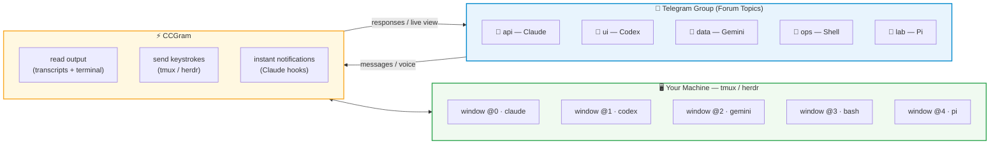

# CCGram — Control AI Coding Agents from Telegram

[](https://github.com/alexei-led/ccgram/actions/workflows/ci.yml)
[](https://pypi.org/project/ccgram/)
[](LICENSE)

**Control AI coding agents from your phone.** Walk away mid-session. Keep monitoring and responding from Telegram—without losing terminal access.

## Why CCGram?

AI coding agents run in your terminal. Other Telegram bots wrap agent SDKs into isolated API sessions you can't resume in your terminal. **CCGram is different.** It sits on top of your terminal multiplexer (tmux or herdr), not any agent SDK. Your agent process stays exactly where it is—your session is the source of truth.

This means:

- **Desktop to phone, mid-conversation** — walk away and keep monitoring from Telegram
- **Phone back to desktop, anytime** — attach to your terminal and you're back with full scrollback
- **Multiple sessions in parallel** — each Telegram topic maps to a separate tmux window or guarded Herdr agent session

---

## How It Works



Each Telegram topic maps to one tmux window. With Herdr, it maps instead to one guarded agent session: `agent.list` is the sole identity source and CCGram persists only an opaque `herdr-session-v1-…` target, never a tab or pane ID. Every action reads a fresh `agent.list` record and fails closed for missing, duplicate, malformed, sessionless, or legacy bindings. A session can still change after that guard and before Herdr dispatches, so delivery is not atomic and may be indeterminate after this post-guard race.

---

## What You Can Do

- **Bind agents to topics** — one agent per Telegram topic; create via directory browser
- **Auto-detect providers** — Supports Claude Code, Codex, Gemini, Pi, Antigravity, OpenCode, and Shell simultaneously
- **Monitor live** — Terminal screenshots on demand or auto-refresh every 5 seconds
- **Send commands** — Slash commands, voice messages (transcribed via Whisper), or raw shell input
- **Run multiple agents in parallel** — each topic independent; run different agents at once
- **Recover gracefully** — Resume, continue, or start fresh if a session crashes
- **Send workspace files** — Share files to Telegram via `/send` (glob, path, or substring search)
- **Action toolbar** — Provider-specific buttons for common actions (Screenshot, Mode, Esc, Enter, etc.)

---

## Quick Start

**Install:**

```bash
uv tool install ccgram          # recommended
# or: pipx install ccgram | brew install alexei-led/tap/ccgram
```

**Telegram setup:**

1. Create a bot via [@BotFather](https://t.me/BotFather) — [full instructions](docs/guides.md#getting-started)
2. Add bot to a Telegram group with Topics enabled; promote to Admin
3. Create `~/.ccgram/.env`:

```ini
TELEGRAM_BOT_TOKEN=your_bot_token_here
ALLOWED_USERS=your_telegram_user_id
CCGRAM_GROUP_ID=your_telegram_group_id
```

Get user ID from [@userinfobot](https://t.me/userinfobot). Get group ID via [@RawDataBot](https://t.me/RawDataBot) (prefix Peer ID with `-100`).

**Run:**

```bash
ccgram
```

Open your Telegram group, create a topic, send a message — directory browser appears. Pick a project directory, choose your agent (Claude, Codex, Gemini, Pi, Antigravity, OpenCode, or Shell), and you're connected.

**Prerequisites:** Python 3.14+, [tmux](https://github.com/tmux/tmux) or [herdr](https://github.com/ogulcancelik/herdr), and one agent CLI. CCGram does not modify agent SDKs.

### Herdr setup

CCGram supports Herdr socket protocols **14–17 and 19–20**. Unknown protocol versions are attempted with a warning for forward compatibility; individual command failures still surface if the protocol is not usable. Install Herdr's integration before launching an agent that needs a native session identity:

```bash
herdr integration install pi
herdr integration install antigravity-cli
```

Restart an already-running agent after installation. Antigravity receives a native Herdr session identity after its first prompt creates a conversation.

Start new agents, or restart already-running agents, after installing the integration so they publish their `agent_session` identity. Then set `CCGRAM_MULTIPLEXER=herdr` and run `ccgram hook --install` as usual.

## Platform Support

CCGram supports Linux, macOS, and WSL2. Native Windows is not supported.

On Windows, install and run CCGram inside WSL2. Install `tmux` or `herdr` and the agent CLI inside the WSL distribution.

Native Windows does not provide the Unix file locking, signal handling, and terminal multiplexer features that CCGram requires.

---

## Documentation

- **[Guides](docs/guides.md)** — CLI reference, configuration, voice transcription, multi-instance setup, session recovery, testing
- **[Providers](docs/providers.md)** — Claude Code, Codex, Gemini, Pi, Antigravity, OpenCode, Shell; session modes, LLM config, custom commands, git worktrees

---

## Optional Features

**Web Dashboard** — Live terminal (xterm.js), transcript search, multi-pane grid in Telegram. Disabled by default. [Enable here.](docs/guides.md#mini-app-dashboard-optional)

---

## Development

```bash
git clone https://github.com/alexei-led/ccgram.git && cd ccgram
uv sync --extra dev
make check         # lint, format, typecheck, test
make test-e2e      # end-to-end tests (requires agent CLIs; see docs/guides.md#e2e-tests)
```

---

## License

[MIT](LICENSE)
